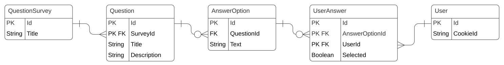

# PGR203 Avansert Java eksamen
[](https://github.com/kristiania-pgr203-2021/pgr203-exam-q10357/actions)

## Beskriv hvordan programmet skal testes:

Bruke maven for å bygge og teste programmet
```bash
mvn package
```

Deretter kan man kjøre pogrammet med kommandoen
```bash
java -jar ./target/Eksamen-1.0-SNAPSHOT.jar
```
Programmet kan opprette spørsmål og lagrer disse i databasen. Det er mulig å legge til spm med tittel/kategori som passer til tema. Så kan man legge til svaralternativer, ved å velge riktig spm. 
Det er også mulig å endre både spm og tittel/katergoi som er valgt. Bruker kan ta surveys ved å sende inn navn. Navnet blir lagret som cookie. 
Det er mulig å liste opp alle svarene som brukerne har svart på. 

Eksempel steg:
1. Trykk på "Make Survey" og "New survey"
2. Legg til Tittel for spørreundersøkelsen, eks Resturaunt
3. Trykk return og gå til new questions for å legge til et spm til undersøkelsen
4. Du kan velge riktig navn på spørreundersøkelse (Resturaunt) og legge til passende tittel/katergi for denne (eks Middag, Dessert, Drikker)
5. Legg til spm til katergien (mat), eks "Stem på hvilken rett du liker".
6. Fyll inn mening for skala label 1(Smakte dårlig) og label 5 (smakte godt), skalaen viser 1-5.
7. Gå tilbake og legg til options.
8. Du må velge riktig spm som du har lagret og legge til svaralternativer. Det kan gjøres flere ganger etterhverandre. Eks( Middag: Stekt and, Wok, Stekt ris, Dessert: Creme brulee, Pai, Is. Drikker: Cola, Vann, Pepsi)
9. Alt skal være lagret, og det er mulig å endre på både spm og tittel/katergori
10. Bruker kan ta "Take survey".
11. Skriv inn ditt navn, dette sendes til server og lagres i SessionUser tabellen.
12. Serveren sette «Set-Cookie» headeren, alle requester vil etter dette ha en Cookie: i header. I vår løsning har vi valgt sessionUserId som cookieName, da vi kan lett bruke dette for å hente tilsvarende sessionUser.
13. Her listes alle surveys, når det lages flere, og man kan legge til flere spm på samme måte, og disse vil da oppdateres under "Take surveys".
14. Bruker velger skala verdi for forskjellige options og sender inn. Det skal ikke være mulig å hoppe over option, alle må besvares før sending.
15. Det skal være mulig å se alle svar for alle brukere under "See answers".
16. Det blir listet alle Surveys, og her kan du trykke inn for å se hva anonyme brukere har svart. Disse listest nedover og er delt i kategori og man ser skala som hver bruker har svart på.

Ekstra:
* Bruker registrere navn og lagres cookie
* Det er mulig å legge til flere spm, så det blir en stor spørreundersøkelse, med mange spm og kategorier
* Lett leselig løsning, organisert data
* Har laget controllers
* Splittet httpMessage
* Server skal returnere riktig feilmelding, 500 hvis noe har gått galt, 404 - ikke funnet, og prøvd å redirecte siden med 303.
* Brukt abstract klasser


Prøvd:
* Har prøvd på favicon.ico:
For å få til dette så måtte vi ha skrevet image-filen tilbake i responsen som en stream. Men dette fikk vi ikke til helt.

* Cookie:
Vi har en svært simpel login side hvor bruker skriver brukers fornavn. Det hadde vært foretrukket å også ha et passord med en hashfunksjon. Da kunne vi ha retrieved sessionused ved å bruke e-post og passord.

Cookie funksjonen ble implementert forholdsvis enkelt, på grunn av den gode HttpMessage klassen, og subklassene HttpResponseMessage og HttpRequestMessage. HttpResponseMessage gjorde det også enkelt å sende responsecode 303 See Other, med headeren Location: «link».
Dette gjorde at vi klarte å implementere den ekstra funksjonaliteten om å sende brukeren tilbake til dit de var før.

Database diagram:


## Sjekkliste

## Vedlegg: Sjekkliste for innlevering

* [x] Dere har lest eksamensteksten
* [ ] Dere har lastet opp en ZIP-fil med navn basert på navnet på deres Github repository
* [x] Koden er sjekket inn på github.com/pgr203-2021-repository
* [x] Dere har committed kode med begge prosjektdeltagernes GitHub konto (alternativt: README beskriver arbeidsform)

### README.md

* [x] `README.md` inneholder en korrekt link til Github Actions
* [x] `README.md` beskriver prosjektets funksjonalitet, hvordan man bygger det og hvordan man kjører det
* [x] `README.md` beskriver eventuell ekstra leveranse utover minimum
* [x] `README.md` inneholder et diagram som viser datamodellen

### Koden

* [x] `mvn package` bygger en executable jar-fil
* [x] Koden inneholder et godt sett med tester
* [x] `java -jar target/...jar` (etter `mvn package`) lar bruker legge til og liste ut data fra databasen via webgrensesnitt
* [x] Serveren leser HTML-filer fra JAR-filen slik at den ikke er avhengig av å kjøre i samme directory som kildekoden
* [x] Programmet leser `dataSource.url`, `dataSource.username` og `dataSource.password` fra `pgr203.properties` for å connecte til databasen
* [x] Programmet bruker Flywaydb for å sette opp databaseskjema
* [x] Server skriver nyttige loggmeldinger, inkludert informasjon om hvilken URL den kjører på ved oppstart

### Funksjonalitet

* [x] Programmet kan opprette spørsmål og lagrer disse i databasen (påkrevd for bestått)
* [x] Programmet kan vise spørsmål (påkrevd for D)
* [x] Programmet kan legge til alternativ for spørsmål (påkrevd for D)
* [x] Programmet kan registrere svar på spørsmål (påkrevd for C)
* [x] Programmet kan endre tittel og tekst på et spørsmål (påkrevd for B)

### Ekstraspørsmål (dere må løse mange/noen av disse for å oppnå A/B)

* [ ] Før en bruker svarer på et spørsmål hadde det vært fint å la brukeren registrere navnet sitt. Klarer dere å implementere dette med cookies? Lag en form med en POST request der serveren sender tilbake Set-Cookie headeren. Browseren vil sende en Cookie header tilbake i alle requester. Bruk denne til å legge inn navnet på brukerens svar
* [x] Når brukeren utfører en POST hadde det vært fint å sende brukeren tilbake til dit de var før. Det krever at man svarer med response code 303 See other og headeren Location
* [x] Når brukeren skriver inn en tekst på norsk må man passe på å få encoding riktig. Klarer dere å lage en <form> med action=POST og encoding=UTF-8 som fungerer med norske tegn? Klarer dere å få æøå til å fungere i tester som gjør både POST og GET?
* [ ] Å opprette og liste spørsmål hadde vært logisk og REST-fult å gjøre med GET /api/questions og POST /api/questions. Klarer dere å endre måten dere hånderer controllers på slik at en GET og en POST request kan ha samme request target?
* [x] Vi har sett på hvordan å bruke AbstractDao for å få felles kode for retrieve og list. Kan dere bruke felles kode i AbstractDao for å unngå duplisering av inserts og updates?
* [x] Dersom noe alvorlig galt skjer vil serveren krasje. Serveren burde i stedet logge dette og returnere en status code 500 til brukeren
* [x] Dersom brukeren går til http://localhost:8080 får man 404. Serveren burde i stedet returnere innholdet av index.html
* [ ] Et favorittikon er et lite ikon som nettleseren viser i tab-vinduer for en webapplikasjon. Kan dere lage et favorittikon for deres server? Tips: ikonet er en binærfil og ikke en tekst og det går derfor ikke an å laste den inn i en StringBuilder
* [ ] I forelesningen har vi sett på å innføre begrepet Controllers for å organisere logikken i serveren. Unntaket fra det som håndteres med controllers er håndtering av filer på disk. Kan dere skrive om HttpServer til å bruke en FileController for å lese filer fra disk?
* [ ] Kan dere lage noen diagrammer som illustrerer hvordan programmet deres virker?
* [x] JDBC koden fra forelesningen har en feil ved retrieve dersom id ikke finnes. Kan dere rette denne?
* [ ] I forelesningen fikk vi en rar feil med CSS når vi hadde `<!DOCTYPE html>`. Grunnen til det er feil content-type. Klarer dere å fikse det slik at det fungerer å ha `<!DOCTYPE html>` på starten av alle HTML-filer?
* [ ] Klarer dere å lage en Coverage-rapport med GitHub Actions med Coveralls? (Advarsel: Foreleser har nylig opplevd feil med Coveralls så det er ikke sikkert dere får det til å virke)
* [ ] FARLIG: I løpet av kurset har HttpServer og tester fått funksjonalitet som ikke lenger er nødvendig. Klarer dere å fjerne alt som er overflødig nå uten å også fjerne kode som fortsatt har verdi? (Advarsel: Denne kan trekke ned dersom dere gjør det feil!)